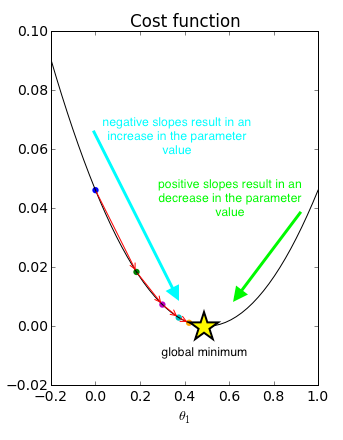
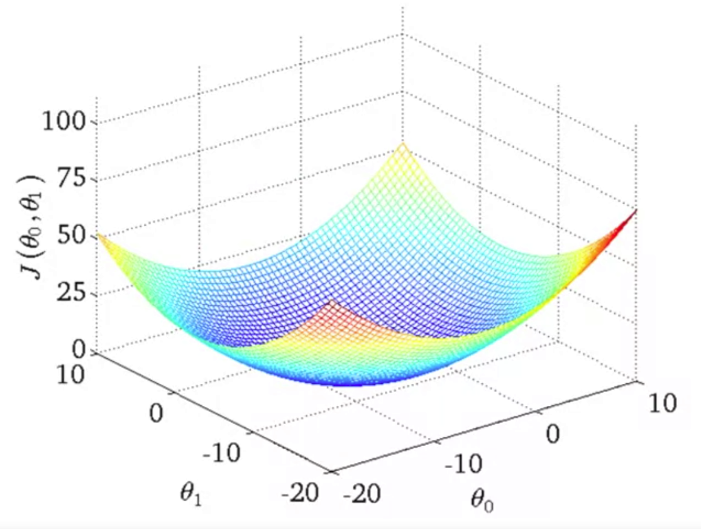
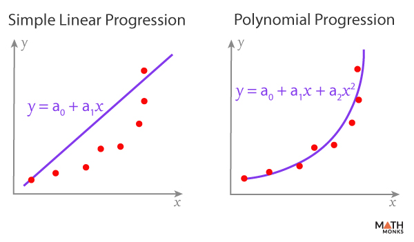

# Makine Öğrenmesi

Amaç, bilgisayarın geçmiş veriler üzerinden öğrendiği örüntü ile yeni örneklere bakarak tahmin yapabilmesi ve karar verebilmesidir.

1. Supervised (Gözetimli)
2. Unsupervised (Gözetimsiz)
3. Reinforcement (Pekiştirmeli)

# 1️ Supervised Learning

Etiketli veriler kullanılarak modelin giriş (X) ile hedef değişken (Y) arasındaki ilişkiyi öğrenmesi.

### Classification

- Logistic Regression
- Decision Tree
- Random Forest
- SVM
- KNN
- Naive Bayes
- Gradient Boosting

### Regression

- Linear Regression
- Ridge / Lasso
- Decision Tree Regressor
- Random Forest Regressor
- Gradient Boosting Regressor

# 2️ Unsupervised Learning

Veriler etiketsizdir. Algoritma verideki yapıları ve örüntüleri keşfeder.

### Clustering

- K-Means
- Hierarchical Clustering
- DBSCAN

### Dimensionality Reduction

- PCA
- t-SNE
- UMAP

### Association Rule Learning

- Apriori
- FP-Growth

# 3️ Reinforcement Learning

Bir agent’ın environment içinde ödül-ceza sistemiyle öğrenmesi.

# Simple Linear Regression

Tek bir girdi (X) ve çıktı (Y) arasındaki doğrusal ilişkiyi modelleyen algoritmadır.

Y = A + BX

Error = y - ŷ

## Cost Function

Cost function, modelin tahmin hatasını ölçen ve minimize edilmesi gereken matematiksel fonksiyondur.
MSE = (1/n) Σ(y - ŷ)²

## Gradient Descent

Gradient Descent hata fonksiyonunun (cost function) minimumunu bulmak için kullanılan optimizasyon algoritmasıdır.
Amaç MSE(Mean Square Error)nin minimize edilmesidir.
Burada A (intercept) ve B (slope) değerlerini en iyi şekilde bulmamız gerekir.
Parametreler güncellenir:

A = A - α ∂MSE/∂A  
B = B - α ∂MSE/∂B

A: Sabit d.
B: Slope
∂MSE/∂A: Cost functionun A parametresine göre türevi

α bizim öğrenme oranımız (minimum globali bulurken attığımız adımın büyüklüğü de denebilir)
eğer α çok büyük olursa model optimal noktayı kaçırabilir fakat α nın çok küçük olduğu durumda öğrenme çok yavaş gerçekleşebilir. Bu yüzden mikro adımlar da atmadan açıyı yavaş yavaş artırarak minimum globali bulmaya çalışırız.

Cost function (MSE), linear regression probleminde parametrelere göre bakıldığında bir paraboldür.
Parabolün en alt noktası global minimumdur.
Bir fonksiyonun minimum veya maksimum olduğu noktada türev sıfırdır.
MSE’nin A (intercept) ve B (slope) parametrelerine göre türevini alma sebebimizbu parametreleri değiştirerek hatanın en küçük olduğu noktayı matematiksel olarak bulabilmektir.

Gradient Descent algoritmasında parametreler eşzamanlı olarak güncellenir. 
Her iterasyonda A ve B birlikte güncellenir ve hata kademeli azaltılır. 
Bu süreç türevlerin sıfıra yaklaşmasına kadar devam eder.

  

# Multiple Linear Regression (Çoklu Doğrusal Regresyon)

Multiple Linear Regression, birden fazla bağımsız değişken (X₁, X₂, ..., Xₙ) ile bir bağımlı değişken (Y) arasındaki doğrusal ilişkiyi modelleyen regresyon yöntemidir.

Basit linear regression’da tek bir X varken, burada birden fazla X değişkeni kullanılır.

### Matematiksel Model

Ŷ = β₀ + β₁X₁ + β₂X₂ + ... + βₙXₙ

Ŷ: Tahmin edilen değer  
β₀: Sabit terim (intercept)  
βᵢ: Katsayılar  
Xᵢ: Bağımsız değişkenler  

βᵢ katsayısı, Xᵢ bir birim arttığında (diğer değişkenler sabitken) Y'nin ne kadar değiştiğini gösterir.

Genellikle Mean Squared Error (MSE) kullanılır:

MSE = (1/n) Σ(y - ŷ)²

Amaç:

min J(β₀, β₁, ..., βₙ)

Cost function tüm parametrelere bağlıdır.

## Gradient Descent ile Güncelleme

Her parametre için kısmi türev alınır:

βⱼ = βⱼ - α ∂MSE/∂βⱼ

Tüm parametreler her iterasyonda eşzamanlı olarak güncellenir.

1 değişken → Doğru
2 değişken → Düzlem
n değişken → Hiper düzlem

  

yüzeyin çukur noktası global minimumdur.

Simple lineer reg ile model ve öğrenme mantığı aynıdır. Sadece katsayı artar, hesap karmaşıklığı artar.

## Model Performans Ölçümü (Regression)

### R-Square
R kare modelin veriye ne kadar iyi uyduğunu ölçer.

R² = 1 - (SS_res / SS_tot)

Burada:
SS_res (Residual Sum of Squares):
Σ (y - ŷ)² yani gerçek değer ile tahmin arasındaki farkların karelerinin toplamı(hata)

SS_tot (Total Sum of Squares):
Σ (y - ȳ)² yani gerçek değerlerin ortalamadan farklarının kare toplamı(total varyans)

y: Gerçek değer  
ŷ: Tahmin edilen değer  
ȳ: Gerçek değerlerin ortalaması  

R² = 1 Model veriyi mükemmel açıklar  
R² = 0 Model ortalamadan daha iyi değildir  
R² < 0 Model ortalamadan daha kötüdür

### Adjusted R-Square

Modele feature eklendiğinde R² artma eğilimindedir fakat bu yanıltıcı olabilir. Eklenen değişken çıktı ile alakasızsa R² gereksiz şişebilir fakat adjusted R², R² nin aksine modelle alakasız olan değişkenleri cezalandırır böylece R² değerinin gereksiz şişmesini önler.
Her zaman hem R² hem de adjusted R² değerlendirilmelidir.

R²_adj = 1 - [ (1 - R²)(n - 1) / (n - p - 1) ]

Burada:
R²: Determinasyon katsayısı  
n: Gözlem (örnek) sayısı  
p: Bağımsız değişken sayısı  

p arttıkça payda küçülür ve bu durum modele karmaşıklık cezası (Eğer yeni feature gerçekten katkı sağlamıyorsa seni cezalandırırım mantığı) uygulanmasına neden olur.

### MSE (Mean Square Error)

MSE = (1 / n) Σ ( y - ŷ )²

Burada:
y   → Gerçek değer  
ŷ   → Tahmin edilen değer  
n   → Gözlem sayısı   

Her zaman pozitiftir. 
Hataların büyüklüğünü artırarak büyük hataları daha çok cezalandırır.
Türevlenebilirliğinden dolayı gradient descente uygun.
Karesini alma durumundan dolayı outlierlara dayanıklı değil.

### MAE (Mean Absolute Error)

MAE = (1 / n) Σ | y - ŷ |

Burada:
y   → Gerçek değer  
ŷ   → Tahmin edilen değer  
n   → Gözlem sayısı  

Outlierlara daha dayanıklı.
Her noktada türevlenebilir değil (0 noktası), gradient descent için çok daha zorludur.

### RMSE (Root Mean Squared Error)

RMSE = √ [ (1 / n) Σ ( y - ŷ )² ]

Burada:
y   → Gerçek değer  
ŷ   → Tahmin edilen değer  
n   → Gözlem sayısı  

MSE gibi büyük hataları cezalandırır.
Sonuçlar orijinal birimde.
Aykırı değerlerden etkilenir.

### Overfitting
Overfitting, modelin eğitim verisine aşırı uyum sağlaması ve bu nedenle yeni, görülmemiş veriler üzerinde düşük performans göstermesi durumudur.

Overfittingde train başarısı yüksek iken test başarısı bir hayli düşüktür.
Model karmaşıklaştıkça bias (sapma) azalır, variance (modelin eğitim verisindeki küçük değişimlere duyarlılığı) artar. Overfitting düşük bias ve yüksek variance kombinasyonunun sonucudur. Model küçük veri değişikliklerine aşırı duyarlı hale gelir ve genelleme yeteneğini kaybeder.

Modele çok fazla ve anlamsız feature eklenmesi, veri setinin küçük olması veya çok yüksek dereceli polynomial modeller kullanılması overfittinge yol açabilir.

### Underfitting

Underfitting, modelin veri içindeki gerçek örüntüyü yeterince öğrenememesi ve hem eğitim verisinde hem de yeni, görülmemiş verilerde düşük performans göstermesi durumudur.

Model çok basit olduğunda veya yeterince eğitilmediğinde bias (sapma) yüksek, variance düşük olur. Underfitting, yüksek bias ve düşük variance kombinasyonunun sonucudur. Model verinin karmaşıklığını temsil edemez ve sistematik hata yapar.

Yetersiz feature kullanımı, çok basit bir model seçimi (örneğin doğrusal ilişki varken karmaşık yapıyı göz ardı etmek), veya yetersiz eğitim süresi underfitting’e yol açabilir.

Hedefimiz düşük bias ve düşük varyansa sahip genelleme yeteneği yüksek modeller üretmek.

## Polynomial Regression

Linear regression verideki ilişki doğrusal değilse yetersiz kalabilir. BU noktada polynomial regression kullanırız.

ŷ = w₀ + w₁x + w₂x² + w₃x³ + ... + wₙxⁿ

Burada:
ŷ: Tahmin edilen değer  
x: Bağımsız değişken  
w₀: Sabit terim (intercept)  
w₁, w₂, ..., wₙ: Katsayılar  
n: Polinom derecesi  

  

Fakat polinom derecesi arttıkça, model karmaşıklığı, parametre sayısı ve variance artar. Bias düşer. Derece arttıkça model daha kıvrımlı olur ve her noktadan neredeyse birebir geçebilir.

Düşük derece:
Model veri trendini yakalayamaz böylece Underfitting olur.

Çok yüksek derece:
Model noktaları tek tek takip eder böylece Overfitting olur.

## Ridge Regression

Ridge Regresyon, Linear Regression modeline L2 Regularization (ceza terimi) eklenmiş halidir.

Amaç:
Overfitting’i azaltmak
Katsayıların aşırı büyümesini engellemek
Multicollinearity (özellikler arası yüksek korelasyon) probleminin etkisini azaltmak

Ridge, hem hatayı minimize etmeye hem de katsayıları küçük tutmaya çalışarak daha stabil ve genellenebilir bir model oluşturur.

Loss = Σ (y − ŷ)² + λ Σ w²

Burada:
Σ (y − ŷ)² Model hatası (MSE)
λ Regularization parametresi
w Model katsayıları
λ Σ w² L2 ceza terimi

Bu ceza terimi büyük katsayıları daha fazla cezalandırır ve modelin varyansını düşürür.

Peki Burada Scaling Neden Önemlidir? 

Ridge’de ceza terimi doğrudan katsayılara bağlıdır.
Eğer featureların ölçekleri farklıysa:
Büyük ölçekli featurelar daha fazla cezalandırılabilir
Küçük ölçekli featurelar daha az etkilenebilir

Bu nedenle Ridge kullanırken feature scaling (örneğin StandardScaler) yapılması önemlidir.

Lambda (Alpha) Nedir?

λ regularization katsayısıdır.
Scikitlearn kütüphanesinde alpha olarak geçer.

alpha = 0 Normal Linear Regression
alpha küçük Hafif regularization
alpha büyük Katsayılar küçülür
alpha çok büyük Underfitting oluşabilir

Regularization:

Biası artırır
Varianceı azaltır
Genelleme performansını iyileştirebilir

Ne Zaman Ridge Kullanılır?

Feature sayısı fazla ise
Multicollinearity varsa
Polynomial regression kullanılıyorsa
Model overfitting yapıyorsa
Katsayılar çok büyük değerler alıyorsa

## Lasso Regression

Lasso Regresyon, Linear Regression modeline L1 Regularization (ceza terimi) eklenmiş halidir.

Amaç:
Overfittingi azaltmak
Gereksiz featureları modelden çıkarmak
Katsayıları küçültmek
Daha sade bir model oluşturmak
Lasso hem hatayı minimize etmeye hem de katsayıları küçültmeye çalışır.
Ancak Ridgeden farklı olarak bazı katsayıları tam olarak sıfıra indirir.
Bu nedenle Lasso aynı zamanda bir feature selection yöntemi olarak da kullanılır.

Loss = Σ (y − ŷ)² + λ Σ |w|
Burada:
Σ (y − ŷ)² Model hatası (MSE)
λ Regularization parametresi
w Model katsayıları
λ Σ |w| L1 ceza terimi
L1 ceza terimi katsayıların mutlak değerini kullanır.

L1 ceza:
Büyük katsayıları küçültür
Bazı katsayıları tamamen sıfır yapar
Modeli sadeleştirir
Feature selection yapar
Bu yüzden Lasso özellikle yüksek boyutlu verilerde çok kullanışlıdır.
Scaling burada da önemlidir.

Ne Zaman Lasso Kullanılır?
Feature sayısı çok fazla ise
Gereksiz featurelar varsa
Daha sade bir model isteniyorsa
Feature selection gerekiyorsa
Overfitting gözlemleniyorsa

Lasso katsayıyı sıfır yapabilir çünkü küçük katsayılara bile sabit bir baskı uygular.
Ridge ise katsayı küçüldükçe baskıyı azaltır, bu yüzden tam sıfır olmaz.
elimizde zaten küçük bir katsayı varsa 
örneğin w = 0.2
λ∑w² L2 penalty (ceza terimi ridge için) ridgede bu ceza tahmin değeri 0.04 olur katsayı küçüldüğü için ceza da küçülür. Ama lassoda bu durum şöyle tezahür eder
Lasso Ceza=|w| katsayı küçük olsa bile ceza aynı şiddette olur bunun sonucunda katsayı zaten küçük olduğu için lasso direkt olarak bu katsayıyı sıfır yapar ve feature silinmiş olur.

## ElasticNet 

ElasticNet, Ridge (L2) ve Lasso (L1) regularization’ın birleşimidir.
ElasticNet hem Ridge’in katsayı küçültme avantajını hem de Lasso’nun feature selection özelliğini bir arada sunar.

Cost = Hata + L1 cezası + L2 cezası

## Cross Validation

Cross Validation (Çapraz Doğrulama), modelin gerçek performansını daha güvenilir ölçmek için kullanılan bir değerlendirme yöntemidir.

Amaç:
Modelin sadece tek bir train–test bölünmesine bağlı kalmasını engellemek
Daha stabil performans ölçmek
Overfitting’i daha net görmek

Cross validationda amaç train test splitteki rastgele ayrılma durumuna daha stabil bir ölçme yöntemiyle çözüm bulmaktır.

### Leave one out Cross Validation (LOOCV)
Her seferinde 1 veri test olur.
Hesaplama maliyeti yüksektir.

### Leave P out Cross Validation (LPOCV)
Her seferinde P veri test olur.
Hesaplama maliyeti yüksektir.
LOOCV'a göre daha çok veri test olabilir ama yine de hala maliyet yüksektir.

### K-Fold Cross Validation
Veri K eşit parçaya bölünür.
Her turda:
1 parça test
K-1 parça train olur.
Bu işlem K kez tekrarlanır.
Tüm test skorlarının ortalaması alınır.

### Stratified K-Fold Cross Validation

K-Foldun classification için özelleşmiş halidir.
Sistem k fold ile aynıdır fakat her foldda sınıf oranları korunur.

### Time Series Cross Validation

Zaman sırasını korur
Data leakage’i engeller
Gerçek hayat senaryosunu simüle eder

